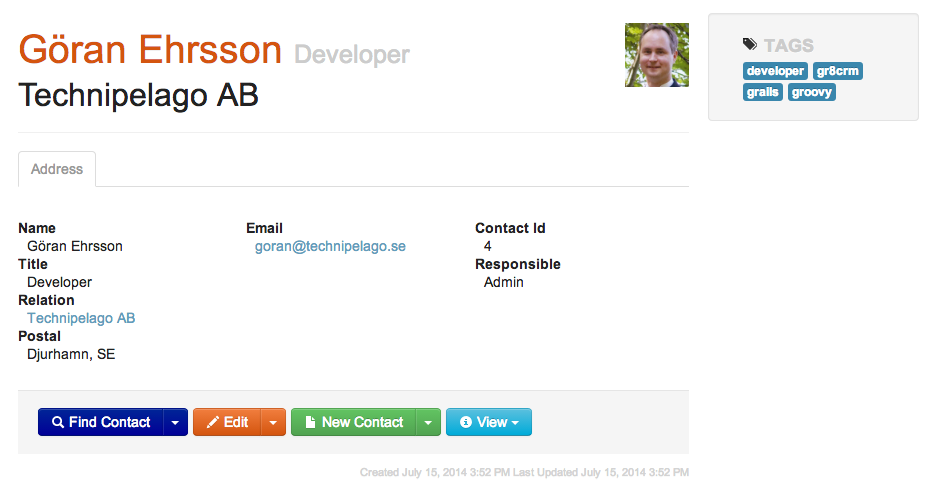

# GR8 Contact

This is a demo application based on the Grails Web Application Framework and the [GR8 CRM plugin suite](http://gr8crm.github.io/).
It was first presented at GR8Conf Europe 2014 by Göran Ehrsson @goeh.

The application is a simple Contact Management application where you can manage your companies and contacts.

The repository has five branches: master and m1-m4 that represents snapshots in time when developing the application.

**master**: A plain Grails application, created with *grails create-app*

**m1**: The plugin *crm-contact-ui* was installed and contact (company/person) CRUD features are available.

**m2**: The plugin *crm-content-ui* was installed and documents/files can now be attached to contacts.

**m3**: The plugin *crm-task-ui* was installed and tasks/appointments with contacts can now be scheduled.

**m4**: The plugin *cookie-layout* was installed and two *themes* were created to show that UI can change depending on sub-domain.

## Greach 2015 - The Groovy spanish conf

Four new branches were created for the speak
[Cut your grails application to pieces - build feature plugins](http://greachconf.com/speakers/goran-ehrsson-cut-your-grails-application-to-pieces-build-feature-plugins/)
at [Greach 2015](http://greachconf.com).

**m1-greach**: Same as **m1** but with Greach theme applied.

**m2-greach**: Same as **m2** but with Greach theme applied.

**m3-greach**: Same as **m3** but with Greach theme applied and option to import Greach 2015 speakers as contacts.

**m4-greach**: Same as **m4** but with Greach theme available. Three themes (Greach, Gr8ConfEU and Gr8ConfUS) available at run-time.
